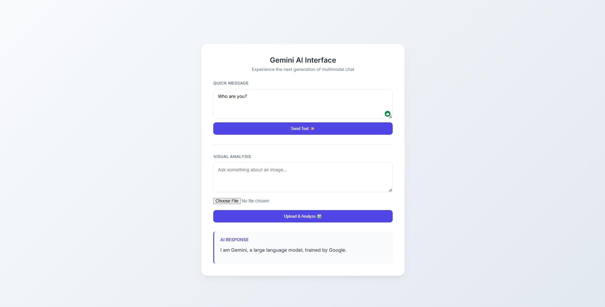
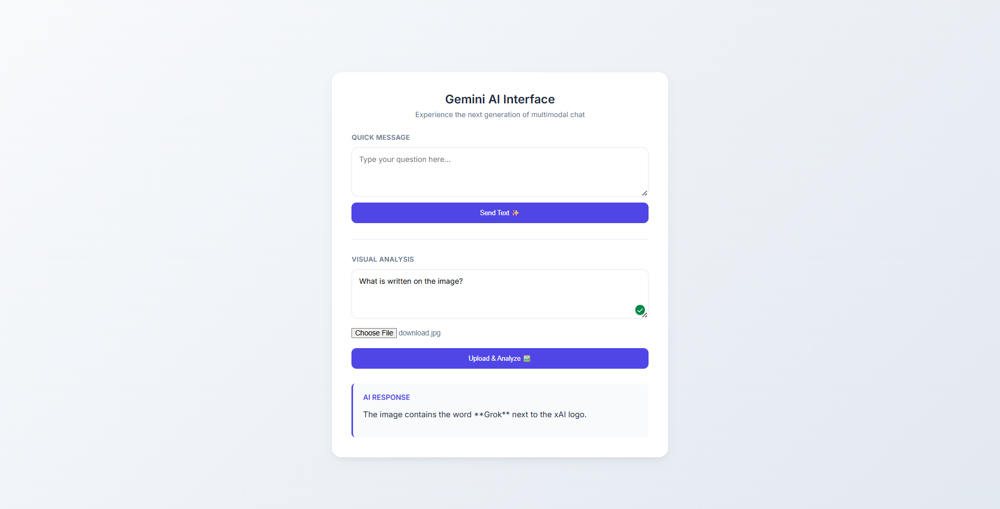

# 🚀 Spring Boot Gemini Integration

Production-ready Spring Boot application integrating **Google Gemini (gemini-3-flash-preview) via Ollama Cloud**.  
Supports both **Text Chat** and **Image + Text Chat** using clean architecture and Thymeleaf UI.

---

## ✨ Features

- ✅ Gemini Text Chat API
- ✅ Gemini Image + Text Chat API (Vision)
- ✅ Spring Boot REST API integration
- ✅ Thymeleaf Web UI
- ✅ Ollama Cloud model support
- ✅ Production-ready service architecture
- ✅ Clean DTO-based request/response structure
- ✅ Multipart file upload support
- ✅ Externalized configuration

---

## 🧠 Supported Model
``
gemini-3-flash-preview:cloud
``


## Powered via:
``
https://ollama.com
``

---

## 🏗 Project Architecture

```
springboot-gemini-integration
│
├── controller
│   ├── GeminiController.java
│   └── PageController.java
│
├── service
│   └── GeminiService.java
│
├── dto
│   ├── ChatRequest.java
│   └── ChatResponse.java
│
├── config
│   └── RestTemplateConfig.java
│
├── templates
│   └── index.html
│
└── application.yml
```

---

## ⚙️ Configuration

### application.yml

```yaml
server:
  port: 8080

gemini:
  api:
    url: http://localhost:11434/api/chat
    model: gemini-3-flash-preview:cloud
```

---

## ▶️ Running the Project

### 1. Start Ollama

```bash
ollama serve
```

---

### 2. Pull Gemini model

```bash
ollama pull gemini-3-flash-preview:cloud
```

---

### 3. Run Spring Boot

```bash
./mvnw spring-boot:run
```

or

```bash
mvn spring-boot:run
```

---

Application runs at:

```
http://localhost:8080
```

---

## 🌐 Web UI

Text Chat  
Image + Text Chat  

Accessible at:

```
http://localhost:8080
```

---

## 📡 REST APIs

---

### 1. Text Chat API

**Endpoint**

```
POST /api/gemini/chat
```

**Request**

```json
{
  "message": "Explain Spring Boot"
}
```

**Response**

```json
{
  "response": "Spring Boot is a Java framework..."
}
```

---

### 2. Image + Text Chat API

**Endpoint**

```
POST /api/gemini/chat-with-image
```

**Form Data**

```
message: What is in this image?
image: file.jpg
```

---

## 🧪 Example Curl

### Text Chat

```bash
curl -X POST http://localhost:8080/api/gemini/chat \
-H "Content-Type: application/json" \
-d '{"message":"Explain AI"}'
```

---

### Image Chat

```bash
curl -X POST http://localhost:8080/api/gemini/chat-with-image \
-F "message=Describe this image" \
-F "image=@test.png"
```

---

## 📸 Screenshots

### Text Chat UI



### Image Chat UI



---

## 🛠 Tech Stack

- Java 17+
- Spring Boot 3+
- Thymeleaf
- RestTemplate
- Ollama Cloud
- Gemini Flash Preview
- Maven

---

## 🧩 Key Components

### GeminiService

Handles communication with Gemini model.

Supports:

- Text chat
- Image + Text chat
- JSON parsing
- Error handling

---

### GeminiController

Provides REST APIs:

```
/api/gemini/chat
/api/gemini/chat-with-image
```

---

### PageController

Provides Web UI integration via Thymeleaf.

---

## 🔒 Production Ready Features

- Layered architecture
- Exception handling
- External configuration
- Multipart upload support
- Clean separation of concerns

---

## 🚀 Future Enhancements

- Multi-model support (Kimi, Qwen, Mistral)
- Streaming responses
- Chat history
- Authentication
- Docker support
- Model router

---

## 👨‍💻 Author

Akash Kobal

GitHub:
https://github.com/AkashKobal

---

## 📄 License

MIT License

---

## ⭐ Support

If this project helped you, please star the repository ⭐
